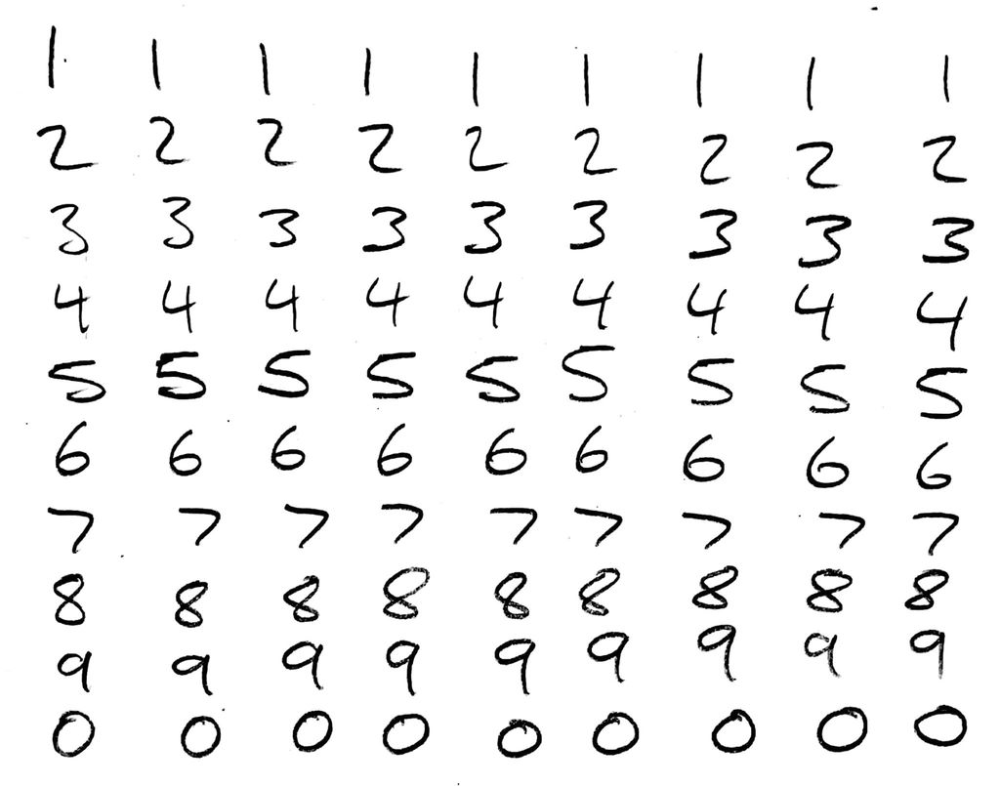
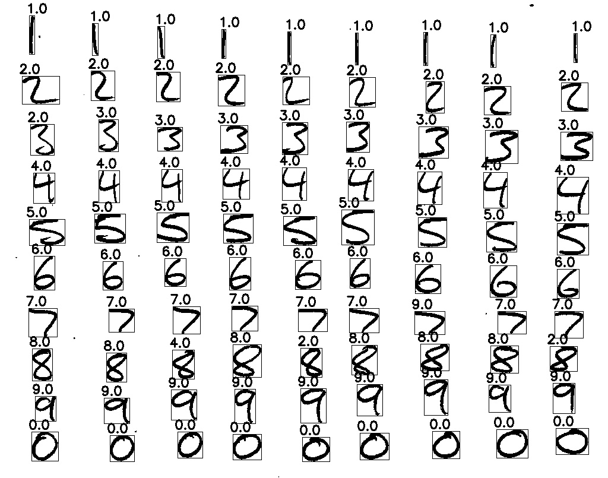

# Simple Digit Recognition

## Getting Started
### Prerequisites
1. Install the following:
- Python 2.7
- Numpy
- OpenCV

### Installing
1. Clone the directory with `git clone git@github.com:aidanclyens88/Simple_Digit_Recognition.git`.

### Running
1. Run using `python input.py filename` to detect the handwritten digits in an image.
2. Run `python input.py --g` to generate new training data files using the training images in the [datasets](./datasets) folder.
3. Run `python input.py --help` for more information.
4. The first time the script is run, training data files will be created in the [datasets](./datasets) folder, named **train_data.data** and **train_labels.data**.

### Adding training data
1. The training images are stored in the [datasets/digits/training](./datasets/digits/training) folder. Each digit is stored in it's respective folder.
2. You may add you own training images to their respective digits folder following the naming scheme (e.g. digits2a.jpg).
3. Each image must be a clear scan with white text on a black background, roughly 1500x1500 px in size.

### Example
Predict the values of the handwritten digits in the [example](./example/example.jpg) image given.
1. `python input.py --g` to generate training data files
2. `python input.py example/example.jpg`

#### Example Test Image Before:

#### Example Test Image After:

This example is 94.44% accurate.

## Author
Copyright 2018 Aidan Clyens
 
